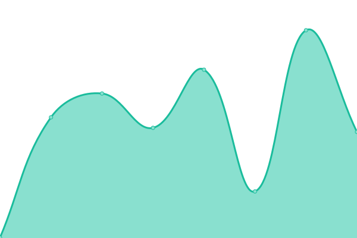
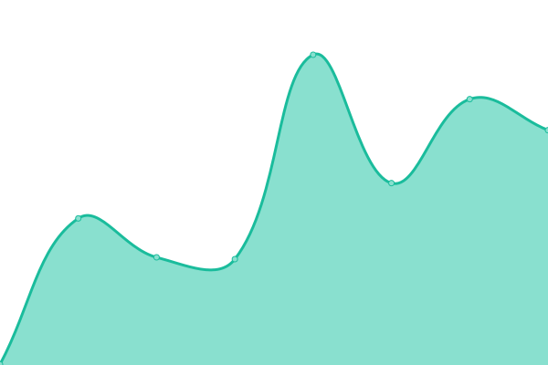

# [📈 Live Status](https://Vorkane.github.io/uptime_status): <!--live status--> **🟧 Partial outage**

This repository contains the open-source uptime monitor and status page for [Vorkane](https://Vorkane.github.io/uptime_status), powered by [Upptime](https://github.com/upptime/upptime).

With [Upptime](https://upptime.js.org), you can get your own unlimited and free uptime monitor and status page, powered entirely by a GitHub repository. We use [Issues](https://github.com/Vorkane/uptime_status/issues) as incident reports, [Actions](https://github.com/Vorkane/uptime_status/actions) as uptime monitors, and [Pages](https://Vorkane.github.io/uptime_status) for the status page.

<!--start: status pages-->
<!-- This summary is generated by Upptime (https://github.com/upptime/upptime) -->
<!-- Do not edit this manually, your changes will be overwritten -->
<!-- prettier-ignore -->
| URL | Status | History | Response Time | Uptime |
| --- | ------ | ------- | ------------- | ------ |
|  [VPN Server](https://vpn.vorkane.pw) | 🟥 Down | [vpn-server.yml](https://github.com/Vorkane/uptime_status/commits/HEAD/history/vpn-server.yml) | 

 283ms
     
 | 

<a href="https://Vorkane.github.io/uptime_status/history/vpn-server">0.00%</a>
    

|  [Foundry VTT](https://foundry.vorkane.pw) | 🟩 Up | [foundry-vtt.yml](https://github.com/Vorkane/uptime_status/commits/HEAD/history/foundry-vtt.yml) | 

 410ms
     
 | 

<a href="https://Vorkane.github.io/uptime_status/history/foundry-vtt">100.00%</a>
    

|  [Pterodactyl](https://pterodactyl.vorkane.pw:9443) | 🟥 Down | [pterodactyl.yml](https://github.com/Vorkane/uptime_status/commits/HEAD/history/pterodactyl.yml) | 

 0ms
     
 | 

<a href="https://Vorkane.github.io/uptime_status/history/pterodactyl">0.00%</a>
    

|  [Project Zomboid - Update 41 - Modded](vorkane.pw) | 🟥 Down | [project-zomboid-update-41-modded.yml](https://github.com/Vorkane/uptime_status/commits/HEAD/history/project-zomboid-update-41-modded.yml) | 

 0ms
     
 | 

<a href="https://Vorkane.github.io/uptime_status/history/project-zomboid-update-41-modded">0.00%</a>
    

<!--end: status pages-->

[**Visit our status website →**](https://Vorkane.github.io/uptime_status)

## 📄 License

- Powered by: [Upptime](https://github.com/upptime/upptime)
- Code: [MIT](./LICENSE) © [Vorkane](https://Vorkane.github.io/uptime_status)
- Data in the `./history` directory: [Open Database License](https://opendatacommons.org/licenses/odbl/1-0/)
